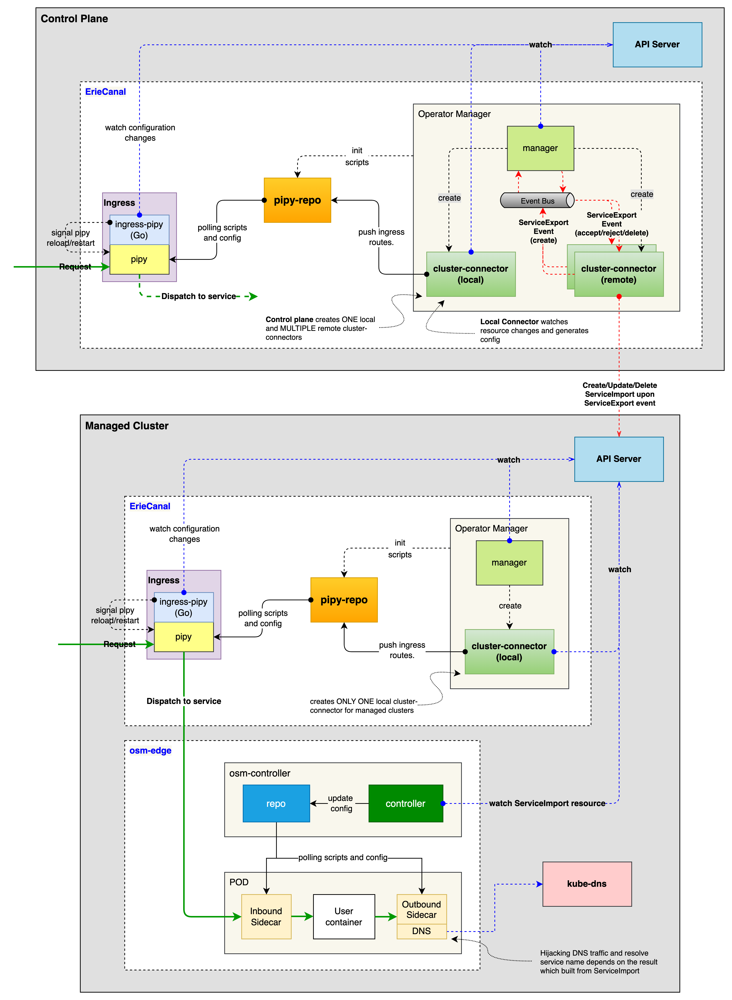

# ErieCanal


ErieCanal is a Kubernetes Multi-Cluster Service API (MCS) implementation, and provides MCS, Ingress, Egress, and Gateway API for Kubernetes clusters.

ErieCanal is an implementation of [Kubernetes Multi-Cluster Service API (MCS)](https://github.com/kubernetes-sigs/mcs-api) that depends on a service mesh and Ingress to provide service registration and discovery capabilities across k8s clusters. When using ErieCanal as an MCS provider, it must be used in conjunction with [osm-edge](https://github.com/flomesh-io/osm-edge), which provides east-west traffic flow capabilities, while ErieCanal provides north-south traffic flow capabilities. ErieCanal also provides the ability to register and discover services across clusters. In the MCS multi-cluster mode, ErieCanal currently supports three traffic modes for Kubernetes clusters that join the ClusterSet: `Locality`, `Failover`, and `ActiveActive`. 

In the `Locality` mode, which is the default configuration, traffic is scheduled based on proximity within the local cluster or can be scheduled to a specific cluster based on topology.In the `ActiveActive` mode, the cluster provides the same traffic processing capabilities as service export (`ServiceExport`) using load balancing. In the `Failover` mode, the importing service (ServiceImport) cluster provides disaster recovery capabilities for the exporting service (ServiceExport) cluster. ErieCanal's implementation does not require the underlying Kubernetes to use a special network and does not require a unified two-layer or three-layer network between the multi-cluster networks. Therefore, it is generally applicable to Kubernetes clusters of various types of networks.

## Architecture



## Install

This chart bootstraps a ErieCanal deployment on a [Kubernetes](http://kubernetes.io) cluster using the [Helm](https://helm.sh) package manager.

### Prerequisites

- Kubernetes 1.19+

### Installing the Chart

To install the chart with the release name `ec` run:

```bash
helm repo add ec https://ec.flomesh.io
helm install ec ec/erie-canal --namespace erie-canal --create-namespace --version=0.1.0-beta.3
```

The command deploys ErieCanal on the Kubernetes cluster using the default configuration in namespace `erie-canal` and creates the namespace if it doesn't exist. The [configuration](#configuration) section lists the parameters that can be configured during installation.

As soon as all pods are up and running, you can start to evaluate ErieCanal.

### Uninstalling the Chart

To uninstall the `ec` deployment run:

```bash
helm uninstall ec --namespace erie-canal
```

The command removes all the Kubernetes components associated with the chart and deletes the release.

### Configuration

Specify each parameter using the `--set key=value[,key=value]` argument to `helm install`. For example,

```bash
helm install ec ec/erie-canal \
  --namespace erie-canal \
  --create-namespace \
  --version=0.1.0-beta.3 \
  --set ec.image.pullPolicy=Always
```

Alternatively, a YAML file that specifies the values for the parameters can be provided while installing the chart. For example,

```bash
helm install ec ec/erie-canal \
  --namespace erie-canal \
  --create-namespace \
  --version=0.1.0-beta.3 \
  -f values-override.yaml
```
