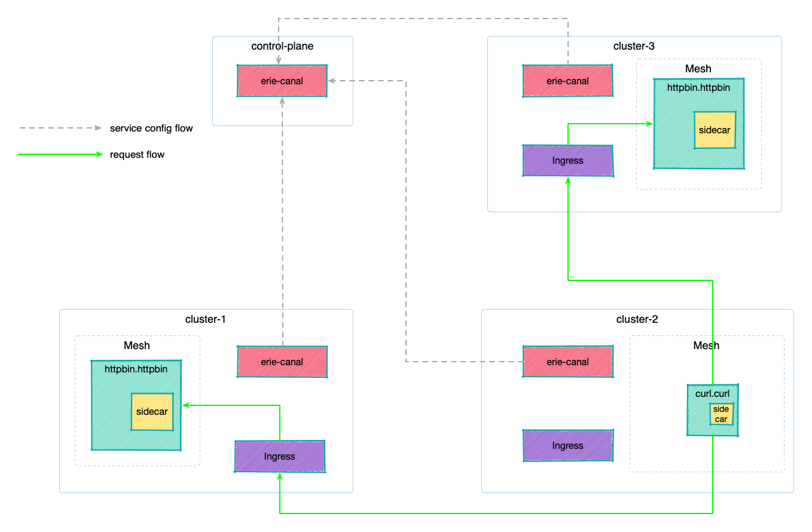

# ErieCanal Multi-cluster Services Demo

To see the multi-cluster services communication demo follow below steps:

## Demo Architecture

## Try it out

**Requires**

* [Docker](https://docs.docker.com/get-docker/)
* [kubectl](https://kubernetes.io/docs/tasks/tools/)

Other pre-requisite utilities like `k3d`, `helm`, `jq`, `pv` if missing, will be installed via os package manager. To run the demo

- `demo/up.sh` - to create and setup 4 demo `k3d` clusters
- `demo/demo.sh` - to run the demo
- `demo/down.sh` - to tear down clusters